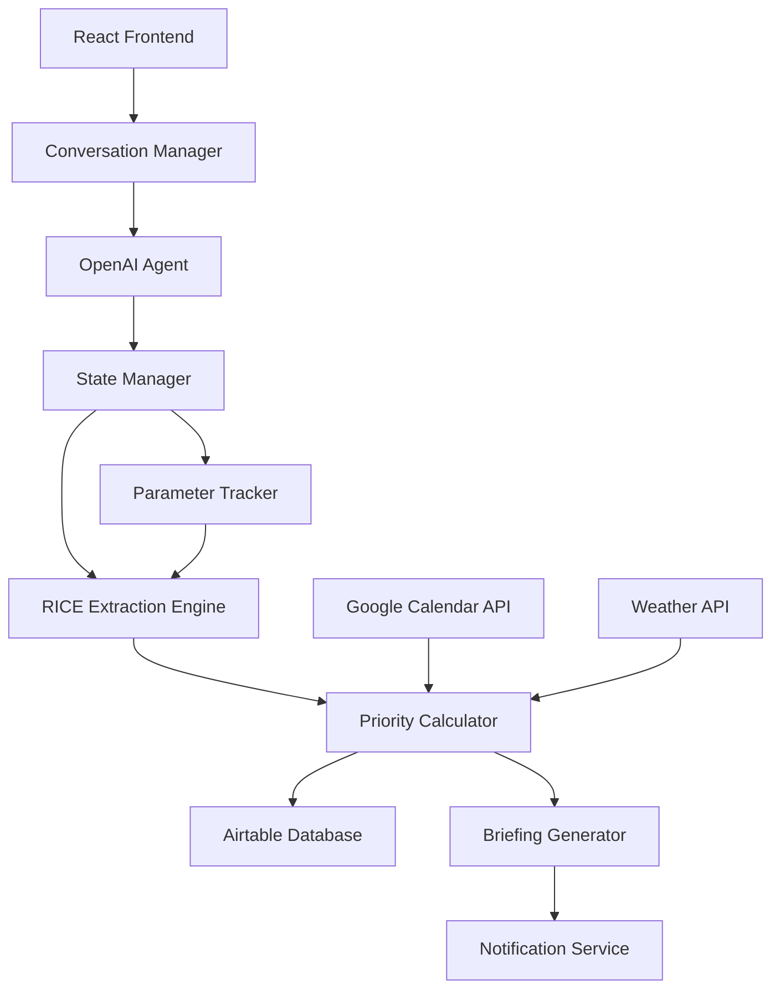

# Product Requirements Document
## Conversational Priority Engine with RICE Automation

### Executive Summary

A conversational AI system that eliminates manual task prioritization by conducting intelligent interviews to extract RICE parameters, automatically calculating priorities, and delivering context-aware daily briefings. The system transforms unstructured brain dumps into actionable, ranked priorities without user intervention.

---

## Problem Statement

Knowledge workers manage 15-30 concurrent tasks across personal and professional domains. Current "smart" scheduling tools (Trevor AI, Motion, Reclaim) still require manual priority assignment, creating decision fatigue. Users need an AI that **makes priority decisions for them**, not just another interface for manual prioritization.

### Core Insight
Users don't want to score tasks - they want to describe them conversationally and have the system understand importance through context extraction.

---

## Solution Overview

### Vision
An AI priority engine that acts as a personal chief of staff - interviewing you about tasks, understanding context, and telling you exactly what to focus on based on multi-dimensional scoring.

### Key Differentiators
1. **Zero Manual Scoring**: RICE parameters extracted through conversation, not forms
2. **Asynchronous Context Building**: Handles partial information across multiple conversations
3. **State-Aware Interviews**: Tracks parameter completeness per task
4. **Automated Execution Tracking**: Calendar integration with status management

---

## Technical Architecture

### System Components



### Tech Stack

**Frontend:**
- React 18 with TypeScript (Web MVP)
- React Native (Test 5)
- Tailwind CSS for UI
- Framer Motion for conversational transitions
- Zustand for state management

**Backend Services:**
- Next.js API routes for server functions
- OpenAI GPT-4 API for conversation and extraction
- Airtable API for task persistence
- Google Calendar API for schedule integration
- OpenWeatherMap API for environmental context
- Twilio/SendGrid for SMS/Email notifications

**Infrastructure:**
- Vercel for hosting and edge functions
- Redis for session and state management
- PostgreSQL for conversation history

---

## Development Milestones & Test Strategy

### Test 1: Conversational RICE Extraction → Airtable
**Goal**: Agent manages partial task information, tracks RICE completeness, writes to Airtable only when complete

#### State Management Architecture

```typescript
interface TaskState {
  id: string;
  description: string;
  parameters: {
    reach?: number;
    impact?: number;
    confidence?: number;
    effort?: number;
  };
  completeness: {
    hasReach: boolean;
    hasImpact: boolean;
    hasConfidence: boolean;
    hasEffort: boolean;
    isComplete: boolean;
  };
  metadata: {
    category?: string;
    deadline?: Date;
    dependencies?: string[];
    shouldSplit?: boolean;
  };
  conversationLog: Message[];
  lastUpdated: Date;
  syncStatus: 'pending' | 'partial' | 'synced';
}

class TaskStateManager {
  private tasks: Map<string, TaskState>;

  canWriteToAirtable(taskId: string): boolean {
    const task = this.tasks.get(taskId);
    return task?.completeness.isComplete || false;
  }

  getMissingParameters(taskId: string): string[] {
    const task = this.tasks.get(taskId);
    const missing = [];
    if (!task.parameters.reach) missing.push('reach');
    if (!task.parameters.impact) missing.push('impact');
    if (!task.parameters.confidence) missing.push('confidence');
    if (!task.parameters.effort) missing.push('effort');
    return missing;
  }

  getPriorityQueue(): TaskState[] {
    return Array.from(this.tasks.values())
      .filter(t => !t.completeness.isComplete)
      .sort((a, b) => {
        // Prioritize tasks closer to completion
        const aComplete = Object.values(a.parameters).filter(Boolean).length;
        const bComplete = Object.values(b.parameters).filter(Boolean).length;
        return bComplete - aComplete;
      });
  }
}
```

#### OpenAI Agent Configuration

```python
# System prompt for state-aware agent
SYSTEM_PROMPT = """
You are a task prioritization assistant that extracts RICE parameters through conversation.

Current State Context:
{task_states}

Rules:
1. Track 4 parameters per task: Reach, Impact, Confidence, Effort
2. Only write to Airtable when ALL 4 parameters are collected
3. Handle asynchronous information - users may provide partial details
4. Intelligently decide which task/parameter to ask about next
5. If a task seems too large, suggest splitting and track sub-tasks

State Tracking:
- Mark parameters as collected when explicitly provided or clearly inferrable
- Update partial state after each exchange
- Prioritize completing near-complete tasks
- Surface which parameters are still needed

Response Format:
- Acknowledge new information
- Update internal state
- Ask for most valuable missing information
- Confirm when task is complete and written to Airtable
"""

def process_conversation(user_input: str, context: TaskContext):
    response = openai.ChatCompletion.create(
        model="gpt-4-turbo-preview",
        messages=[
            {"role": "system", "content": SYSTEM_PROMPT.format(
                task_states=context.get_state_summary()
            )},
            {"role": "user", "content": user_input}
        ],
        functions=[
            {
                "name": "update_task_state",
                "parameters": {
                    "task_id": "string",
                    "updates": {
                        "reach": "number | null",
                        "impact": "number | null",
                        "confidence": "number | null",
                        "effort": "number | null"
                    }
                }
            },
            {
                "name": "write_to_airtable",
                "parameters": {
                    "task_id": "string",
                    "rice_score": "number"
                }
            },
            {
                "name": "split_task",
                "parameters": {
                    "parent_task_id": "string",
                    "subtasks": "array"
                }
            }
        ]
    )
    return response
```

#### Asynchronous Interview Flow

```yaml
# Example conversation handling partial information

User: "I need to prep for the board meeting and fix the API bug"

Agent: "I'll track both tasks. For the board meeting, when is it scheduled?"

User: "Thursday"

Agent: [Updates: board_meeting.deadline = Thursday]
"Got it. The board meeting is in 3 days. How many people will be attending?"

User: "Actually, let me tell you about the API bug first - it's affecting 500 users"

Agent: [Updates: api_bug.reach = 500]
"That's significant reach for the API bug. What functionality is broken?"

User: "Payment processing. Oh and the board meeting has 12 attendees"

Agent: [Updates: api_bug.impact = high, board_meeting.reach = 12]
"Critical impact on the API bug with payment processing down. For the bug fix, how long would it take to resolve?"

User: "Maybe 2 hours"

Agent: [Updates: api_bug.effort = 2]
"2 hours for the API bug. How confident are you in that fix time?"

User: "Pretty confident, like 80%"

Agent: [Updates: api_bug.confidence = 0.8]
[State Check: api_bug has all 4 parameters ✓]
[Action: write_to_airtable(api_bug)]
"Perfect! I've added the API bug to your priorities with a RICE score of 85.
Now back to the board meeting - what's the impact if it goes well?"

# Continues until all tasks have complete parameters...
```

#### Success Criteria for Test 1
- [ ] Agent maintains state across multiple conversation turns
- [ ] Correctly tracks parameter completeness per task
- [ ] Only writes to Airtable when all 4 RICE parameters present
- [ ] Handles context switching between tasks gracefully
- [ ] Suggests task splitting when appropriate
- [ ] Upserts parameters when new context provided

---

### Test 2: Daily Plan Generation
**Goal**: User can request daily plan conversationally, agent generates prioritized schedule

#### Command Recognition Patterns
```typescript
const DAILY_PLAN_TRIGGERS = [
  "what should I do today",
  "create my daily plan",
  "what are my priorities",
  "plan my day",
  "what's on deck",
  "brief me"
];
```

#### Daily Plan Generator

```python
async def generate_daily_plan(user_id: str, date: str = "today"):
    # Fetch from Airtable
    tasks = await airtable.get_tasks(
        user_id=user_id,
        status="pending",
        order_by="rice_score"
    )

    # Get calendar context
    calendar_events = await gcal.get_events(
        user_id=user_id,
        date=date
    )

    # Calculate available time blocks
    available_blocks = calculate_free_time(calendar_events)

    # Fit tasks to available time
    daily_plan = optimize_task_placement(
        tasks=tasks,
        available_time=available_blocks,
        user_preferences=get_user_preferences(user_id)
    )

    # Generate natural language response
    response = openai.ChatCompletion.create(
        model="gpt-4-turbo-preview",
        messages=[{
            "role": "system",
            "content": "Convert this structured plan into a conversational daily briefing"
        }, {
            "role": "user",
            "content": json.dumps(daily_plan)
        }]
    )

    return response
```

#### Sample Daily Plan Output
```
"Here's your focused plan for today:

**Morning Block (9-11:30am):**
Fix the API bug affecting payments - this is your highest RICE score at 85. You've got a clear 2.5 hour window before your lunch meeting.

**Afternoon Sprint (2-3:30pm):**
Board meeting prep - with Thursday's deadline, this needs attention today. I've blocked 90 minutes after your team standup.

**Quick Wins (between meetings):**
- Email John about pricing (15 min) - slot this after your 3:30 coffee break
- Review pull request (10 min) - perfect for the gap before your 5pm

You have 4.5 hours of focused work time today. The payment bug should be your north star - everything else can shift if needed."
```

#### Success Criteria for Test 2
- [ ] Recognizes multiple phrasings for plan request
- [ ] Fetches complete task list from Airtable
- [ ] Integrates calendar availability
- [ ] Generates coherent time-blocked schedule
- [ ] Provides reasoning for prioritization
- [ ] Handles conflicts/overlaps intelligently

---

### Test 3: Calendar Population & Status Management
**Goal**: Agent writes plan to Google Calendar, tracks execution status, adjusts via conversation

#### Calendar Event Schema
```typescript
interface PriorityEvent {
  id: string;
  taskId: string;
  title: string;
  start: DateTime;
  end: DateTime;
  description: string;
  colorId: string; // Visual priority indicator
  extendedProperties: {
    private: {
      riceScore: number;
      taskStatus: 'scheduled' | 'in_progress' | 'completed' | 'deferred';
      airtableId: string;
    }
  }
}
```

#### Conversational Calendar Management

```python
class CalendarOrchestrator:
    def __init__(self):
        self.gcal = GoogleCalendarAPI()
        self.status_mapper = StatusMapper()

    async def populate_calendar(self, daily_plan: DailyPlan):
        """Write plan to calendar with smart conflict resolution"""

        for task in daily_plan.tasks:
            event = self.create_calendar_event(task)

            # Check for conflicts
            conflicts = await self.gcal.check_conflicts(
                start=event.start,
                end=event.end
            )

            if conflicts:
                # Attempt auto-resolution
                resolution = self.resolve_conflict(event, conflicts)
                if resolution.needs_user_input:
                    return {
                        "status": "conflict",
                        "message": f"'{task.title}' conflicts with '{conflicts[0].title}'. Should I move it to {resolution.suggested_time}?",
                        "options": resolution.options
                    }
                else:
                    event = resolution.adjusted_event

            # Create calendar event
            created = await self.gcal.create_event(event)

            # Update Airtable with calendar link
            await airtable.update_task(
                task.id,
                calendar_event_id=created.id,
                status="scheduled"
            )

    async def handle_status_update(self, user_input: str):
        """Process conversational status updates"""

        # Examples:
        # "I finished the API bug fix"
        # "Push the board prep to tomorrow"
        # "I'm halfway through the research task"

        intent = self.extract_intent(user_input)

        if intent.type == "completion":
            await self.mark_complete(intent.task_id)
            await self.trigger_rebalance()

        elif intent.type == "deferral":
            await self.defer_task(intent.task_id, intent.new_date)

        elif intent.type == "progress":
            await self.update_progress(intent.task_id, intent.percentage)
```

#### Status State Machine
```typescript
enum TaskStatus {
  PENDING = 'pending',        // In Airtable, not scheduled
  SCHEDULED = 'scheduled',    // On calendar
  IN_PROGRESS = 'in_progress', // Started
  COMPLETED = 'completed',    // Done
  DEFERRED = 'deferred',     // Pushed out
  BLOCKED = 'blocked'        // Waiting on dependency
}

const STATUS_TRANSITIONS = {
  pending: ['scheduled'],
  scheduled: ['in_progress', 'deferred', 'completed'],
  in_progress: ['completed', 'blocked', 'deferred'],
  completed: [],
  deferred: ['scheduled'],
  blocked: ['scheduled', 'deferred']
};
```

#### Success Criteria for Test 3
- [ ] Successfully creates calendar events from daily plan
- [ ] Handles calendar conflicts with smart suggestions
- [ ] Updates task status based on conversation
- [ ] Syncs status between Calendar and Airtable
- [ ] Triggers re-prioritization on completion/deferral
- [ ] Maintains event-task linkage for tracking

---

### Test 4: Multi-Channel Notifications
**Goal**: Send daily briefings via email/SMS based on user preference

#### Notification Service Architecture

```python
class NotificationOrchestrator:
    def __init__(self):
        self.email_client = SendGridClient()
        self.sms_client = TwilioClient()
        self.preferences = UserPreferenceStore()

    async def send_daily_briefing(self, user_id: str, plan: DailyPlan):
        prefs = await self.preferences.get(user_id)

        # Format based on channel
        if prefs.channel == 'email':
            message = self.format_email_briefing(plan)
            await self.email_client.send(
                to=prefs.email,
                subject=f"Your priorities for {plan.date}",
                html=message.html,
                text=message.text
            )

        elif prefs.channel == 'sms':
            message = self.format_sms_briefing(plan)
            # SMS needs to be concise
            chunks = self.split_for_sms(message, max_length=1600)
            for chunk in chunks:
                await self.sms_client.send(
                    to=prefs.phone,
                    body=chunk
                )

        elif prefs.channel == 'both':
            # Send both in parallel
            await asyncio.gather(
                self.send_email(user_id, plan),
                self.send_sms(user_id, plan)
            )

    def format_email_briefing(self, plan: DailyPlan) -> EmailMessage:
        """Rich HTML email with task cards"""
        html = f"""
        <div style="font-family: -apple-system, sans-serif; max-width: 600px;">
            <h2>Today's Focus</h2>

            <div style="background: #f3f4f6; padding: 16px; border-radius: 8px; margin: 16px 0;">
                <h3 style="margin-top: 0;">🎯 Priority #1</h3>
                <p><strong>{plan.top_task.title}</strong></p>
                <p>{plan.top_task.reasoning}</p>
                <p>⏱ {plan.top_task.effort} hours | 📊 RICE: {plan.top_task.rice_score}</p>
            </div>

            <h3>Your Schedule</h3>
            <ul>
                {"".join([f"<li>{slot.time}: {slot.task}</li>" for slot in plan.schedule])}
            </ul>

            <div style="background: #fef3c7; padding: 12px; border-radius: 6px; margin-top: 16px;">
                <p style="margin: 0;"><strong>⚡ Quick wins:</strong> {', '.join(plan.quick_wins)}</p>
            </div>
        </div>
        """
        return EmailMessage(html=html, text=self.html_to_text(html))

    def format_sms_briefing(self, plan: DailyPlan) -> str:
        """Ultra-concise SMS format"""
        return f"""Today's priorities:

1. {plan.top_task.title} ({plan.top_task.effort}h)
   → {plan.top_task.reasoning[:50]}

2. {plan.second_task.title} ({plan.second_task.effort}h)

3. {plan.third_task.title} ({plan.third_task.effort}h)

Free time: {plan.available_hours}h
First block: {plan.first_available_slot}

Reply 'DONE [#]' to mark complete."""
```

#### Conversational Notification Preferences

```yaml
User: "Send me my daily plan"
Agent: "I'll send your daily plan. How would you prefer to receive it - email or text?"

User: "Text"
Agent: "Got it. What time should I send your daily briefing?"

User: "7:30am"
Agent: [Saves preference]
"Perfect. You'll get your daily priorities via text at 7:30am each day. Today's plan is on its way now."

# Later...
User: "Also email me the full version"
Agent: [Updates preference to 'both']
"I'll send both text and email briefings going forward. Email will have the full detail, text will be your quick reference."
```

#### Success Criteria for Test 4
- [ ] Sends formatted email briefings
- [ ] Sends concise SMS briefings
- [ ] Handles user preference configuration
- [ ] Supports scheduling/timing preferences
- [ ] Includes actionable response options (SMS)
- [ ] Falls back gracefully on delivery failure

---

### Test 5: React Native & UX Improvements
**Goal**: Mobile app with refined conversational UX

#### React Native Architecture

```typescript
// Core App Structure
const App = () => {
  return (
    <NavigationContainer>
      <Stack.Navigator>
        <Stack.Screen name="Chat" component={ChatScreen} />
        <Stack.Screen name="DailyPlan" component={DailyPlanScreen} />
        <Stack.Screen name="TaskList" component={TaskListScreen} />
        <Stack.Screen name="Settings" component={SettingsScreen} />
      </Stack.Navigator>
    </NavigationContainer>
  );
};

// Conversational Interface Component
const ChatScreen = () => {
  const [messages, setMessages] = useState<Message[]>([]);
  const [inputMode, setInputMode] = useState<'text' | 'voice'>('text');
  const [taskStates, setTaskStates] = useState<Map<string, TaskState>>();

  return (
    <SafeAreaView style={styles.container}>
      <StatusBar taskStates={taskStates} />

      <MessageList
        messages={messages}
        renderMessage={(msg) => (
          <MessageBubble
            message={msg}
            showRICEProgress={msg.type === 'task_update'}
          />
        )}
      />

      <QuickActions>
        <ActionButton onPress={() => sendMessage("What's my plan?")}>
          Daily Plan
        </ActionButton>
        <ActionButton onPress={() => sendMessage("What's next?")}>
          Next Task
        </ActionButton>
      </QuickActions>

      <InputBar
        mode={inputMode}
        onSend={handleSend}
        onModeToggle={() => setInputMode(prev =>
          prev === 'text' ? 'voice' : 'text'
        )}
      />
    </SafeAreaView>
  );
};
```

#### UX Improvements

**1. Progressive Disclosure UI**
```typescript
const RICEProgressIndicator = ({ task }: { task: TaskState }) => {
  const progress = Object.values(task.parameters).filter(Boolean).length;

  return (
    <View style={styles.progressContainer}>
      <Text style={styles.taskTitle}>{task.description}</Text>
      <ProgressBar
        progress={progress / 4}
        color={progress === 4 ? '#10b981' : '#f59e0b'}
      />
      <View style={styles.parameterChips}>
        {['R', 'I', 'C', 'E'].map((param, i) => (
          <Chip
            key={param}
            filled={!!Object.values(task.parameters)[i]}
            label={param}
          />
        ))}
      </View>
      {progress < 4 && (
        <Text style={styles.hint}>
          Need: {task.getMissingParameters().join(', ')}
        </Text>
      )}
    </View>
  );
};
```

**2. Voice Input with Real-time Transcription**
```typescript
const VoiceInput = () => {
  const [isRecording, setIsRecording] = useState(false);
  const [transcript, setTranscript] = useState('');

  const startRecording = async () => {
    const stream = await navigator.mediaDevices.getUserMedia({ audio: true });
    const recognition = new webkitSpeechRecognition();

    recognition.continuous = true;
    recognition.interimResults = true;

    recognition.onresult = (event) => {
      const current = event.resultIndex;
      const transcript = event.results[current][0].transcript;
      setTranscript(transcript);
    };

    recognition.start();
  };

  return (
    <Animated.View style={[
      styles.voiceContainer,
      isRecording && styles.voiceRecording
    ]}>
      <TouchableOpacity onPressIn={startRecording} onPressOut={stopRecording}>
        <MicrophoneIcon animated={isRecording} />
      </TouchableOpacity>
      {transcript && (
        <Text style={styles.transcript}>{transcript}</Text>
      )}
    </Animated.View>
  );
};
```

**3. Smart Suggestions**
```typescript
const SmartSuggestions = ({ context }: { context: ConversationContext }) => {
  const suggestions = useMemo(() => {
    // Contextual suggestions based on state
    if (context.hasPendingTasks) {
      return [
        `${context.nextMissingParam} for ${context.nearestIncompleteTask}`,
        "Show me what's missing",
        "Skip to daily plan"
      ];
    }

    if (context.isEndOfDay) {
      return [
        "Mark API bug as complete",
        "What's left for today?",
        "Move remaining to tomorrow"
      ];
    }

    return [
      "Add a new task",
      "Show my priorities",
      "What should I focus on?"
    ];
  }, [context]);

  return (
    <ScrollView horizontal style={styles.suggestions}>
      {suggestions.map(suggestion => (
        <SuggestionChip
          key={suggestion}
          onPress={() => handleSuggestion(suggestion)}
        >
          {suggestion}
        </SuggestionChip>
      ))}
    </ScrollView>
  );
};
```

**4. Gesture-based Task Management**
```typescript
const TaskCard = ({ task }: { task: Task }) => {
  const translateX = useSharedValue(0);

  const gestureHandler = useAnimatedGestureHandler({
    onActive: (event) => {
      translateX.value = event.translationX;
    },
    onEnd: () => {
      if (translateX.value > 100) {
        // Swipe right - mark complete
        runOnJS(markComplete)(task.id);
      } else if (translateX.value < -100) {
        // Swipe left - defer
        runOnJS(deferTask)(task.id);
      }
      translateX.value = withSpring(0);
    }
  });

  return (
    <PanGestureHandler onGestureEvent={gestureHandler}>
      <Animated.View style={[
        styles.taskCard,
        useAnimatedStyle(() => ({
          transform: [{ translateX: translateX.value }]
        }))
      ]}>
        <TaskContent task={task} />
      </Animated.View>
    </PanGestureHandler>
  );
};
```

#### Success Criteria for Test 5
- [ ] Native iOS and Android apps functional
- [ ] Voice input with accurate transcription
- [ ] Gesture controls for task management
- [ ] Real-time sync with web version
- [ ] Push notifications for priority changes
- [ ] Offline mode with sync on reconnect
- [ ] Smart suggestions improve task completion rate
- [ ] RICE progress indicators reduce confusion
- [ ] Sub-3 second response time for all interactions

---

## Performance Metrics & Monitoring

### Key Performance Indicators

| Metric | Target | Measurement |
|--------|--------|-------------|
| **Parameter Extraction Rate** | > 90% accuracy | User validation of auto-extracted RICE scores |
| **Task Completion Rate** | > 70% of top-3 daily | Calendar event status tracking |
| **Conversation Efficiency** | < 5 messages per complete task | Message count to RICE completion |
| **Daily Plan Engagement** | > 80% daily active | Briefing opens + plan requests |
| **State Recovery Success** | 100% | Ability to resume partial conversations |

### Error Handling & Recovery

```python
class ConversationRecovery:
    async def recover_state(self, user_id: str):
        """Rebuild state from persistent storage if agent fails"""

        # Fetch incomplete tasks from Airtable
        incomplete_tasks = await airtable.query(
            filter="AND({sync_status} != 'synced', {user_id} = '{}'".format(user_id)
        )

        # Reconstruct conversation state
        for task in incomplete_tasks:
            state = TaskState(
                id=task.id,
                description=task.description,
                parameters=task.get_partial_parameters(),
                conversation_log=task.conversation_history
            )

            # Identify next questions
            missing = state.get_missing_parameters()

            # Queue for next interaction
            self.queue_follow_up(task.id, missing)

        return {
            "recovered_tasks": len(incomplete_tasks),
            "ready_for_continuation": True
        }
```

---

## Risk Mitigation

| Risk | Impact | Mitigation |
|------|--------|------------|
| **State loss between conversations** | User must re-provide information | Redis persistence + Airtable backup of partial states |
| **OpenAI API failures** | Conversation interruption | Implement retry logic, fallback to GPT-3.5, cache common patterns |
| **Parameter extraction ambiguity** | Incorrect RICE scores | Confirmation step before Airtable write, allow user correction |
| **Calendar sync conflicts** | Double-booking or lost tasks | Two-way sync with conflict detection, user approval for changes |
| **Notification fatigue** | User disengagement | Smart batching, importance thresholds, quiet hours |

---

## Security & Privacy Considerations

- **Data Encryption**: All task data encrypted at rest in Airtable
- **API Key Management**: User OAuth for Google Calendar, secure token storage
- **Conversation Privacy**: No conversation logs retained beyond session
- **GDPR Compliance**: Data export and deletion capabilities

---

**PRD Version**: 2.0
**Last Updated**: [Current Date]
**Status**: Ready for Test-Driven Development